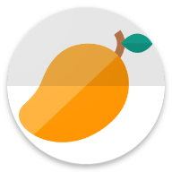

# AMG
> Atturu's Mango Garden App.

[![NPM Version][npm-image]][npm-url]
[![Build Status][travis-image]][travis-url]
[![Downloads Stats][npm-downloads]][npm-url]

One to two paragraph statement about your product and what it does.



## About

AMG:

```sh
Atturu’s Mango Garden (AMG), established in 2002. We have the following varieties of mangoes. Bengalur, Benisha, Himayuddin, Juice Mango, Khadar, Neelam, Neelesha, Pickle Mango, Punasa, and Sindhura.  This garden is more than just land and trees. It’s Atturu’s heritage and future.
```


## For information Contact

Contact us:

Nageswara Reddy Atturu

atturusmangogarden@gmail.com

Atturu’s Mango Garden Rd, Balija Palli, PV Puram Panchayath,

Tirupathi, A.P, 517561


## Release History

* 1.2.0
    * CHANGE: Update docs 
* 2.1.0
    * CHANGE: Added functionality to about page
    * CHANGE: Performance optimizations
    * CHANGE: Bugs Fixed
    


## Meta

Avaliable for Only Android.

PlayStore Link:.

[https://play.google.com/store/apps/details?id=com.master.gardens](https://play.google.com/store/apps/details?id=com.master.gardens)

## Contributing

1. Fork it (<https://github.com/yourname/yourproject/fork>)
2. Create your feature branch (`git checkout -b feature/fooBar`)
3. Commit your changes (`git commit -am 'Add some fooBar'`)
4. Push to the branch (`git push origin feature/fooBar`)
5. Create a new Pull Request

<!-- Markdown link & img dfn's -->
[npm-image]: https://img.shields.io/npm/v/datadog-metrics.svg?style=flat-square
[npm-url]: https://npmjs.org/package/datadog-metrics
[npm-downloads]: https://img.shields.io/npm/dm/datadog-metrics.svg?style=flat-square
[travis-image]: https://img.shields.io/travis/dbader/node-datadog-metrics/master.svg?style=flat-square
[travis-url]: https://travis-ci.org/dbader/node-datadog-metrics
[wiki]: https://github.com/yourname/yourproject/wiki
